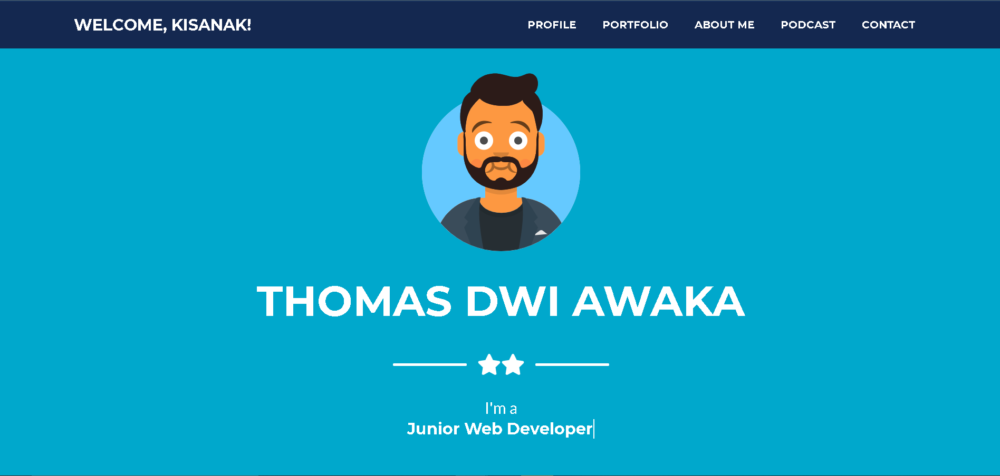

# Web CV Pribadi
Pemula | Second Project HTML & CSS | Curriculum Vitae

## Konten
Dalam Website CV sebaiknya mencakup beberapa konten yang sama layaknya sebuah cv pada umumnnya. Pada websiteku, konten yang aku pakai antara lain:
- Profil diri (nama, TTL, nomor HP, email)
- Bahasa pemrograman yang dikuasai
- Hasil project yang pernah dibuat. baik dari tugas kuliah ataupun proyek dengan client
- Media sosial

Disini aku menambahkan juga tempat untuk podcastku, ya sekalian promosi podcast. Pada web ini, aku menggunakan HTML, CSS, Javascript yang dibantu dengan Bootsrap dan Canva & avataaars untuk bagian asetnya.

## HTML
HTML akan menjadi kerangka/pondasi dari website. HTML pada web ini menghasilkan 600++ line, sehingga cukup panjang dan menurutku cukup sulit jika ingin memeriksa bagian tertentu, maka aku akan membaginya jadi 4 bagian yaitu:
- index : menjadi kerangka utama dari HTML
- portfolio : bagian yang menampilkan aset yang berhubungan dengan portfolio
- models : bagian yang menampilkan informasi detail dari aset portfolio, tersambung dengan javascript
f- ooter : bagian footer dari website, berisi lokasi pembuatan, copyright dan sosial media yang bisa dikunjungi
Cara untuk menyambungkan setiap file .HTML ini menggunakan script yang dibuat oleh w3school yaitu includeHTML. Web ini dibuat dengan didominasi warna gelap, soalnya nyaman dimata sih hehe

## CSS
Untuk bagian CSS-nya menggunakan default dari boostrap, yaitu styles.css. Akan tetapi, aku tambahkan beberapa modifikasi warna, agar sesuai dengan modifikasi dark mode.

## Javascript
Penggunaan java script ini untuk membuat website statis ini lebih "hidup". seperti topbar yang dapat mengecil jika di-scroll kebawah, menampilkan animasi kalimat yang diketik, cara menampilkan detail dari portfolio, dan fungsi untuk menghubungkan setiap file .HTML ke index.html.
